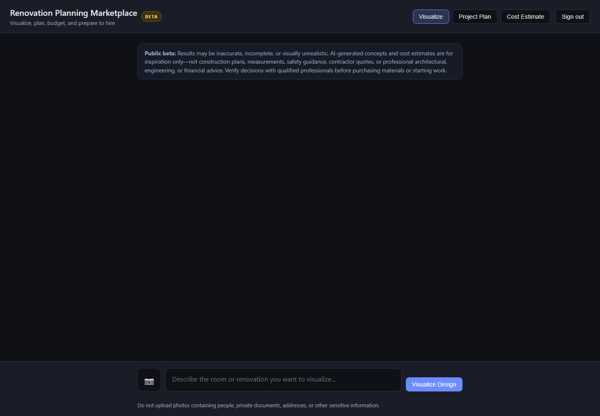
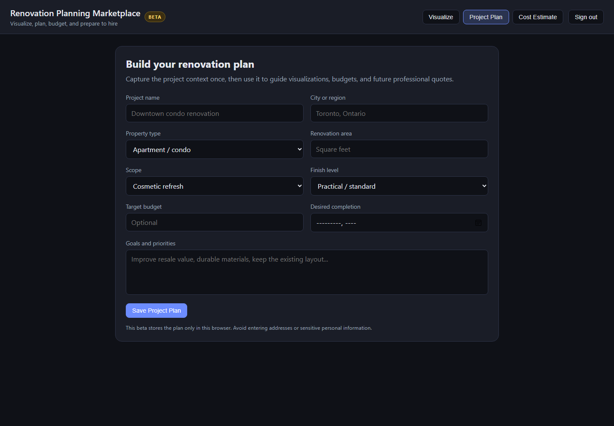
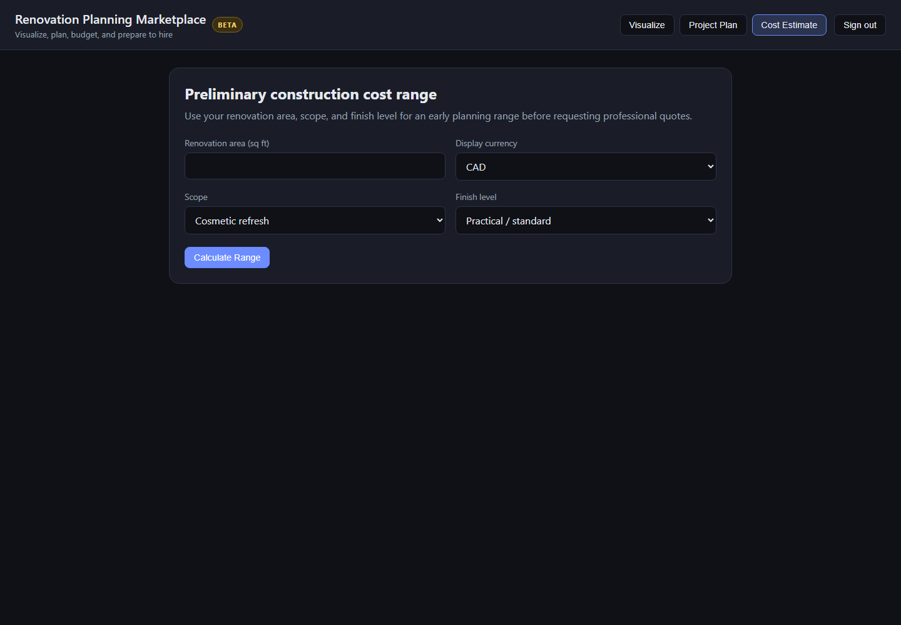

# Interior Design Visualizer

A portable Flask application for room analysis and AI renovation visualization.

| Renovation visualizer | Project planning | Preliminary costs |
|---|---|---|
|  |  |  |

The interface presents the product as a renovation-planning marketplace with three
initial workflows:

- **Visualize** creates and edits renovation concepts from room photographs.
- **Project Plan** records the property context, scope, goals, target budget, finish
  level, and timeline in the user's browser-local storage.
- **Cost Estimate** produces a broad, transparent planning range from the saved area,
  scope, and finish level. It is explicitly not a quote and does not replace local
  contractors, designers, permit authorities, or other qualified professionals.

The cost assumptions are illustrative beta defaults rather than live regional pricing.
Future marketplace integrations can replace them with versioned regional cost data and
structured quotes from verified professionals.

## Roadmap

- Before-and-after comparison and richer material/style presets
- Saved multi-room projects and shareable renovation briefs
- Versioned regional cost data with dated assumptions and source attribution
- Product and material discovery from local retailers
- Permit guidance backed by authoritative jurisdiction-specific sources
- Verified contractor, designer, architect, and specialist directories
- Structured quote requests and side-by-side proposal comparison
- Project milestones, purchasing checklists, and renovation progress tracking

These are planned marketplace capabilities, not features available in the current beta.

## Setup

1. Open this folder in Visual Studio Code.
2. Create a virtual environment (recommended):

```bash
python -m venv .venv
```

3. Install dependencies and configure secrets:

```powershell
python -m pip install -r requirements.txt
$env:OPENAI_API_KEY = "your-api-key"
$env:APP_USERNAME = "admin"
$env:APP_PASSWORD = "use-a-long-random-password"
$env:APP_SECRET_KEY = "use-an-independent-random-secret"
python app.py
```

Open `http://localhost:5000`. In HTTPS production deployments, also set
`COOKIE_SECURE=true`. Do not commit any of these values.

Security defaults include authentication, CSRF protection, multimodal moderation,
request and image limits, security headers, an eight-hour session lifetime, and
rate limiting. Redis-backed sessions and rate limits activate when `REDIS_URL` is
set; otherwise the app uses local process memory.

Prompts and source photos are moderated before inference. Direct safeguard-override
and secret-extraction attempts are rejected. Generated text and images are moderated
again before they are returned or written to storage; moderation failures fail closed.

Provider calls use bounded timeouts and retries configured by
`PROVIDER_TIMEOUT_SECONDS` and `PROVIDER_MAX_RETRIES`. Public errors use stable codes
and request references without exposing provider responses, credentials, or stack
traces. Failed browser requests preserve the prompt so the user can retry safely.

Each authenticated account (or anonymous browser when public access is enabled) has
minute and daily request quotas. Uncached AI calls also reserve a conservative cost
estimate against `USER_DAILY_SPEND_LIMIT_USD` before contacting the provider. Redis
makes quota reservations atomic across workers. The estimates are configurable because
they are guardrails rather than provider invoices; keep provider-side billing limits
and alerts enabled as the final authority.

Room photographs remain in browser and request memory rather than being saved as
source files by this application. They are sent to OpenAI for moderation and AI
processing. Generated outputs are deleted from local or S3-compatible storage after
`IMAGE_RETENTION_HOURS`; a background worker checks every
`IMAGE_CLEANUP_INTERVAL_SECONDS`. See [PRIVACY.md](PRIVACY.md) for the user-facing
privacy notice and important third-party retention limitations.

Completed results are cached for `RESULT_CACHE_TTL_SECONDS` (one hour by default).
Repeating the same authenticated user, source image, instruction, and task reuses
the saved result without another model call. New instructions still require model
inference. Redis shares this cache across workers; a single-process memory fallback
is used when Redis is unavailable.

## Portable deployment

Copy `.env.example` to `.env`, fill in strong secrets, then run:

```bash
docker compose up --build
```

`OPENAI_API_KEY` must contain a real key, not an empty value. The server can boot
without one so health checks and alternative providers remain available, but
OpenAI generation and the shared moderation gateway will return a configuration
error until it is set.

This starts the app at `http://localhost:7860`, Redis for shared sessions and rate
limits, and MinIO for S3-compatible generated-image storage. Images expire after
`IMAGE_RETENTION_HOURS` (24 by default). The application also works without these
services, using process memory and local disk.

For a Hugging Face deployment, follow the complete [Docker Space launch guide](docs/HUGGING_FACE.md).
The Space uses port 7860. Local generated images are ephemeral unless an external
S3-compatible service is configured. A Hugging Face Storage Bucket can also be
integrated as a later persistence option.

For Kubernetes, build and publish the image, replace the example image name in
`k8s/app.yaml`, and follow `k8s/README.md`.

`ALLOW_PUBLIC_ACCESS=true` removes the login requirement. It is intentionally off
by default: public anonymous access spends the operator's model credits. If you
enable it, keep daily limits low and add provider-side budgets/alerts. Fork users
can instead supply their own server-side keys through environment secrets.

## Model providers

OpenAI is the default provider and supports analysis, generation, and editing.
Additional server-side providers can be enabled with environment credentials:

```powershell
# Google Vertex AI (uses Application Default Credentials)
$env:GOOGLE_CLOUD_PROJECT = "your-project-id"
$env:GOOGLE_CLOUD_LOCATION = "global"
$env:VERTEX_MODEL = "gemini-3.5-flash"
$env:VERTEX_IMAGE_MODEL = "gemini-3.1-flash-image"

# Anthropic (text and image analysis; no image output)
$env:ANTHROPIC_API_KEY = "your-anthropic-key"
$env:ANTHROPIC_MODEL = "claude-sonnet-4-6"
```

`OPENAI_API_KEY` remains required for the shared multimodal moderation gateway,
even when another generation provider is selected. Provider keys and Google
credentials are never sent to the browser.

The OpenAI workflow uses a hybrid model architecture:

Customer prompts first pass through a lightweight NLU intent router. Obvious renovation
targets are resolved locally; ambiguous references use `NLU_MODEL` with strict JSON
Schema Structured Outputs. The validated intent determines whether to edit the current
image, create a new scene, or ask a clarification question instead of guessing.
Ambiguous classifications are cached for `INTENT_CACHE_TTL_SECONDS`.

- **Analyze** uses `gpt-6-astra` without an image-generation tool.
- **Fast Preview / Fast Edit** uses `gpt-image-2.5-flare` through Astra's
  Responses API image tool.
- **High Quality / High Quality Edit** uses `gpt-image-2.5-sunburst` through
  the dedicated Image Edit API at high quality. The original uploaded room
  remains the immutable source for every follow-up; generated results never replace it
  automatically.

Direct edits pass through a local structural-similarity gate before moderation and
storage. It compares aspect ratio, grayscale layout, gradients, and edges against the
original room. Outputs below `SCENE_SIMILARITY_THRESHOLD` are discarded; if every
alternative drifts, the request returns a `scene_drift` error instead of displaying a
different room. Explicit comparison boards are exempt because their layout is intentional.

After uploading a room, paint the area to renovate directly on the photograph. The
red overlay can be erased, cleared, and resized with the brush control. When a mask is
present, the server sends a normalized alpha-channel PNG with the source to the Image
Edit API and instructs the model to preserve everything outside the selection. Masks
are optional, limited to `MAX_MASK_BYTES`, and may cover no more than
`MAX_MASK_COVERAGE` of the photograph by default.

Generated alternatives do not silently replace the source photograph. To continue
designing from a result, select **Edit this result** beneath that image. The browser
then loads that exact result as the explicit source for the next prompt and offers a
fresh optional mask. This supports iterative renovation branches without accidentally
losing the original-room reference.

Vertex AI and Anthropic remain available as alternative analysis providers.

## Public beta launch checklist

- [ ] Finish UI and mobile usability.
- [x] Verify per-user rate limits and application spending controls.
- [x] Publish a privacy notice and automatically delete generated images.
- [x] Complete reliable error-handling tests.
- [x] Run abuse and moderation tests.
- [x] Add visible Beta and AI-output disclaimers.
